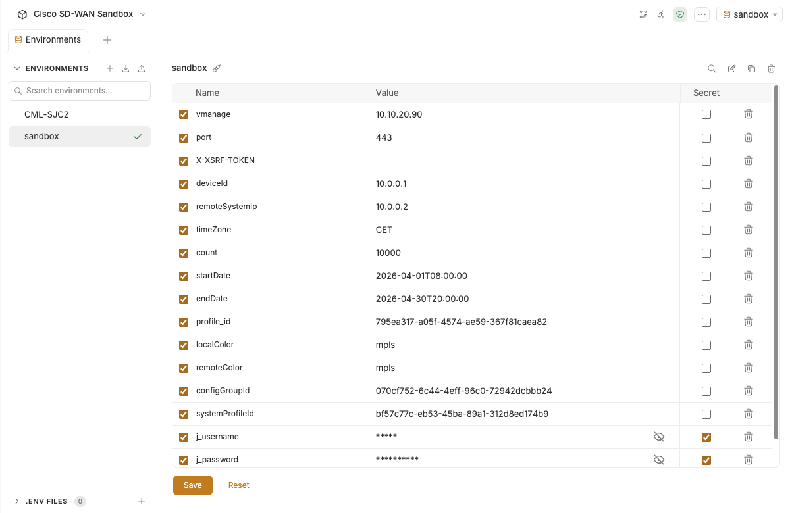

# Bruno Collection Examples

This collection provides several examples of working with the Cisco Catalyst SD-WAN and Meraki Dashboard APIs.

## Bruno

Bruno is an open-source, lightweight API client designed as a fast and privacy-focused alternative to tools like Postman and Insomnia. It has gained significant popularity among developers who prefer a "local-first" workflow and want to avoid the cloud-heavy features and forced logins of traditional API platforms.

Key Features of Bruno

- Offline-First & Local Storage: Unlike Postman, which syncs your data to its cloud by default, Bruno stores your API collections directly on your local filesystem. There is no mandatory cloud sync and no requirement to create an account or log in.
- Git-Friendly (The .bru Format): Bruno saves requests in a plain-text markup language called .bru. Because these are simple text files, you can commit your API collections directly into your Git repository alongside your source code. This makes branching, merging, and code reviews for APIs seamless.
- Lightweight and Fast: Bruno is built to be a focused tool rather than an all-in-one "platform." This results in much faster startup times and lower memory usage compared to Postman.
- Scripting and Testing: It supports JavaScript for pre-request scripts and post-response tests, similar to Postman, allowing for complex automation and data manipulation.
- Multi-Protocol Support: It handles REST, GraphQL, and gRPC APIs.
- Open Source: Released under the MIT License, it allows for community contributions and transparency.

You can download it for Windows, Mac, or Linux from the [official website](https://www.usebruno.com/).

## Collections

This repository has 3 collections:

- Cisco-SD-WAN: Includes examples for Cisco Catalyst SD-WAN Manager.
- Meraki: Features examples for the Meraki Dashboard API.
- Misc: Additional examples and resources.

Start Bruno then open collections from the "Collections" folder.

- SD-WAN collection: click "Open Collection", find and select "Cisco-SD-WAN" folder
- Meraki collection: click "Open Collection, find and select "Meraki" folder
- Various examples: click "Open Collection, find and select "Misc" folder

## Secrets

In any collection, there are secrets that need to be managed. These secrets can be anything such as API keys, passwords, or tokens.

A common practice is to store these secrets in environment variables and you want to ensure that the secrets are stripped out of the collection before it is shared. Bruno offers three (3) approaches to manage secrets in collections.

- Secret Variables
- DotEnv File
- Integration with a Secret Manager

This repo uses Secret Variables. In this approach, you can check the secret checkbox for any variable in your environment. Bruno will manage your secrets internally and will not write them into the environment file.



Your environment file at `<collection-name</environments/<name>.bru` would look like

```bru
vars {
  port: 443
  X-XSRF-TOKEN:
  deviceId: 10.0.0.1
  remoteSystemIp: 10.0.0.2
  timeZone: CET
  count: 10000
  startDate: 2025-08-01T08:00:00
  endDate: 2025-08-31T20:00:00
  profile_id: xxxx
  localColor: mpls
  remoteColor: mpls
  configGroupId: yyyy
}
vars:secret [
  j_username,
  vmanage,
  j_password
]
```

And now you can safely check in your collection to source control without worrying about exposing your secrets.

When you export your collection as a file, Bruno will not export the secret variables.

