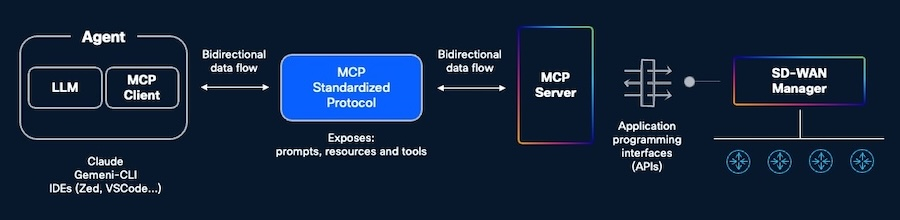
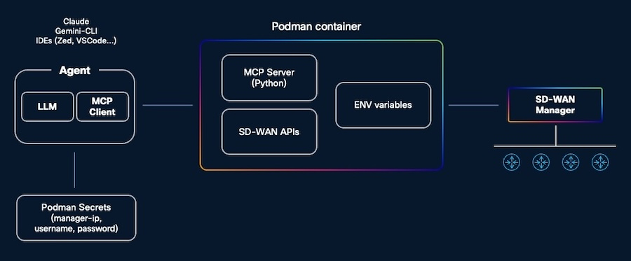

# 🚀 Cisco Catalyst SD-WAN MCP server

[](https://modelcontextprotocol.io/)
[](https://podman.io/)

## Purpose

This repository contains an MCP (Model-Context-Protocol) server that serves as a bridge to a Cisco Catalyst SD-WAN Manager instance. The server exposes a set of tools for interacting with the SD-WAN environment, such as retrieving device lists, checking device statuses, and accessing detailed device information. By enabling these interactions, the MCP server allows integration with conversational AI agents—including interfaces like Gemini CLI, Claude, and other large language models (LLMs)—so users can manage and query their SD-WAN infrastructure through natural language commands.

## Prerequisites

- Podman installed and running
- Network connectivity to Cisco Catalyst SD-WAN Manager
- Valid Cisco Catalyst SD-WAN Manager credentials with read/write access

## Architecture

An MCP (Model-Context-Protocol) server is a middleware component that provides a standardized interface for interacting with network management systems, such as Cisco Catalyst SD-WAN Manager. Its architecture typically consists of modules for handling API requests, translating data models, managing context, and ensuring secure protocol communication between clients and the SD-WAN environment. For a more detailed overview of the MCP server architecture and its features, please refer to the [official documentation](https://modelcontextprotocol.io/docs/getting-started/intro).



The following diagram illustrates the interaction flow between a conversational AI agent (such as Gemini CLI or Claude) and a Cisco SD-WAN environment. The AI agent communicates with the SD-WAN MCP Server, which runs inside a Podman container. The MCP Server then interfaces with the Cisco vManage REST API to perform actions and retrieve data. Sensitive connection details—such as the vManage host, port, username, and password—are securely provided to the container using Podman Secrets, ensuring secure and managed access to the SD-WAN infrastructure.



## Clone this repository

```bash
git clone https://github.com/CiscoDevNet/wan-automation-examples
cd wan-automation-examples/catalystwan/mcp-sdwan
```

## Install Podman

Visit: <https://podman.io/>

Here's a recipe to get things going on a Mac:

```bash
# 1. Install Podman using Brew:
brew install podman

# 2. Check Podman's version:
podman --version

# 3. Start Podman's machine:
podman machine init --now

# 4. Run the hello-world container:
podman run --rm hello-world
```

## Building podman SD-WAN MCP container

```bash
./build_container.sh
```

## Set Up Podman Secrets

```bash
# Create secrets for vManage host, port, username and password:
echo -n "your-vmanage-hostname.com" | podman secret create vmanage_host -
echo -n "your-vmanage-port" | podman secret create vmanage_port -
echo -n "your-vmanage-username" | podman secret create vmanage_username -
echo -n "your-vmanage-password" | podman secret create vmanage_password -

# List all secrets to verify:
podman secret ls

# Inspect secret metadata (with or without revealing value):
podman secret inspect [--showsecret] vmanage_host
podman secret inspect [--showsecret] vmanage_port
podman secret inspect [--showsecret] vmanage_username
podman secret inspect [--showsecret] vmanage_password
```

## Use the MCP Server

Agent will run the podman container with the MCP server inside, passing the necessary secrets for connecting to the SD-WAN Manager.

### Configure MCP Server in Claude Desktop

Find your Claude Desktop config file:

- macOS: ~/Library/Application Support/Claude/claude_desktop_config.json
- Windows: %APPDATA%\Claude\claude_desktop_config.json
- Linux: ~/.config/Claude/claude_desktop_config.json

Edit the file and add your MCP server configuration:

```json
{
    "mcpServers": {
        "sdwan-sw-check": {
            "command": "/opt/podman/bin/podman",
            "args": [
                "run",
                "-i",
                "--rm",
                "--secret",
                "vmanage_host,type=env,target=VMANAGE_HOST",
                "--secret",
                "vmanage_port,type=env,target=VMANAGE_PORT",
                "--secret",
                "vmanage_username,type=env,target=VMANAGE_USERNAME",
                "--secret",
                "vmanage_password,type=env,target=VMANAGE_PASSWORD",
                "sdwan-sw-check-mcp-server:latest"
            ]
        }
    }
}
```

> NOTE: Make sure to include the full path to podman binary (you can find it with `which podman` command).

Restart Claude Desktop.

### Configure MCP Server in Gemini CLI

Install Gemini CLI (if not already installed)

```bash
npm install -g @google/gemini-cli
```

or on a Mac:

```bash
brew install gemini-cli
```

Configure your `~/.gemini/settings.json` file.

Use command, args, and transport. The args array will contain the podman run command and all its necessary arguments to start your container in an interactive, ephemeral way suitable for stdio communication.

```json
{
    "mcpServers": {
        "sdwan-mcp-server": {
            "command": "podman",
            "args": [
                "run",
                "-i",
                "--rm",
                "--secret",
                "vmanage_host,type=env,target=VMANAGE_HOST",
                "--secret",
                "vmanage_port,type=env,target=VMANAGE_PORT",
                "--secret",
                "vmanage_username,type=env,target=VMANAGE_USERNAME",
                "--secret",
                "vmanage_password,type=env,target=VMANAGE_PASSWORD",
                "sdwan-mcp-server:latest"
            ],
            "transport": "stdio"
        }
    }
}
```

Restart gemini-cli if it was running.

### Configure MCP Server in Zed Editor

Visit: <https://zed.dev/docs/ai/mcp>

```json
{
    "context_servers": {
        "sdwan-mcp-server": {
            "source": "custom",
            "enabled": true,
            "command": "podman",
            "args": [
                "run",
                "-i",
                "--rm",
                "--secret",
                "vmanage_host,type=env,target=VMANAGE_HOST",
                "--secret",
                "vmanage_port,type=env,target=VMANAGE_PORT",
                "--secret",
                "vmanage_username,type=env,target=VMANAGE_USERNAME",
                "--secret",
                "vmanage_password,type=env,target=VMANAGE_PASSWORD",
                "sdwan-mcp-server:latest"
            ],
            "env": {}
        }
    }
}
```

## Troubleshooting

```bash
# Check if image was created
podman images

# List your containers
podman ps -a

# View container logs if needed (after first run)
podman logs [CONTAINER_ID]

# Remove secrets if needed (for re-creation)
podman secret rm vmanage_host
podman secret rm vmanage_port
podman secret rm vmanage_username
podman secret rm vmanage_password

# Remove and rebuild if needed
podman rmi sdwan-mcp-server:latest
podman build -t sdwan-mcp-server -f Containerfile .
```

Access container as root user for debugging:

```bash
podman exec -it -u root <container_id> bash
```

## Local Testing

Copy `.env_example` to `.env` and update parameters.

To quickly verify your server works, use the MCP Inspector:

```bash
npx @modelcontextprotocol/inspector uv run sdwan_mcp_server.py
```

This will open a web interface where you can:

- See all available tools
- Test each tool with parameters
- View responses in real-time
- Monitor server logs

## Adding more MCP tools

Prompt:

```example

# Catalyst SD-WAN MCP Server in Python

## INITIAL CLARIFICATIONS

The MCP Server is developed in Python and runs inside a podman container.

I want to create a MCP tool that will list all configuration groups defined in Catalyst SD-WAN Manager.
List all associated profiles with their name and ID.

Here is the link to the main Catalyst SD-WAN API documentation page: https://developer.cisco.com/docs/sdwan/overview/

This is divided into several sections, each with its own page:

- Administration and Settings: https://developer.cisco.com/docs/sdwan/administration-and-setting-overview/
- Monitoring and Troubleshooting: https://developer.cisco.com/docs/sdwan/monitoring-and-troubleshooting-overview/
- UX 1.0 Configuration: https://developer.cisco.com/docs/sdwan/ux-1-0-configuration-overview/
- UX 2.0 Configuration: https://developer.cisco.com/docs/sdwan/ux-2-0-configuration-overview/
- Feature Profiles - SD-WAN System: https://developer.cisco.com/docs/sdwan/feature-profiles-sd-wan-system-overview/
- SD-WAN Services: https://developer.cisco.com/docs/sdwan/sd-wan-services-overview/
- Partner Integrations: https://developer.cisco.com/docs/sdwan/partner-integrations-overview/

Please also search online for any additional Cisco Catalyst SD-WAN API documentation.

If any information is missing or unclear, I will ask for clarification before proceeding.

# INSTRUCTIONS FOR THE LLM

## YOUR ROLE

You are an expert MCP (Model Context Protocol) server developer. You will create a complete, working MCP server based on the user's requirements, optimized for Podman container runtime.

## CLARIFICATION PROCESS

API endpoint functions are defined in this file: `@api/sdwan.py`. You will add any necessary function based on the request.

The MCP tools are defined in this file: `@sdwan_mcp_server.py`. Add necessary tools in addition to what is already available. Make it so that the output is clear and attractive (tables, bullet lists).

Create tools in this existing file: `@sdwan_mcp_server.py` based on user requirements.
Check the existing tools to have the baseline technical requirements.

Each tool must:
- Use @mcp.tool() decorator
- Use empty string defaults (param: str = "") NOT None
- Have simple parameter types
- Return a formatted string or dictionary
- Include proper error handling

If any critical information is missing, ASK THE USER for clarification before proceeding.

```

## Podman vs Docker

This server uses Podman, which offers several advantages:

- **Rootless by default** - Enhanced security without root privileges
- **Daemonless** - No background daemon required
- **Pod support** - Native Kubernetes pod compatibility
- **Drop-in replacement** - Compatible with Docker commands
